# Итоговая работа по модулю «Безопасность операционных систем, системное программирование»- Михалёв Сергей.

## Легенда
<details>
<summary>Описание</summary>
Компания Х использует корпоративное сетевое приложение "Защищённый контур", позволяющее "безопасно" обмениваться корпоративной информацией (в том числе хранить персональные данные клиентов и информацию, отнесённую к коммерческой тайне). Вам предстоит проанализировать само приложение на уязвимости, а также настройки ОС на серверах, где это приложение функционирует.

Компания разработчик поставляет уже настроенный сервер в виде [OVA](https://drive.google.com/file/d/1YMAQjcHKimoWVMCAr7G7-ZgNk1cvBaFU/view?usp=sharing) (md5 = 5935192d257a003b85584a84dec83367), который (по их заверениям) вполне безопасен и может использоваться "из коробки" (т.е. достаточно импортировать в среду виртуализации и можно запускать в боевой среде).

По информации, полученной от разработчика, цитата: "приложение содержит механизмы безопасности и может использоваться при построении ИСПД до 4 УЗ включительно и систем, обрабатывающих коммерческую тайну".

Документация на приложение разработчиком не предоставлена, поскольку, цитата: "интерфейс интуитивно понятный, обучающих материалов для пользователей не требуется".

Исходные коды так же не предоставлены.

Вас, как специалиста, попросили выполнить анализ данного приложения с точки зрения его реальной защищённости.

</details>

## Техническая информация

<details>
<summary>Описание</summary>

Цитата:
```
Логин/пароль пользователя в ОС OVA - system/system (после первого запуска необходимо сменить пароль).

Все файлы приложения располагаются в каталоге /opt/sk

Приложение предназначено для работы в ОС Linux x86_64

Приложение настроено в качестве сервиса systemd - sk.service

Приложение запускается на порту 8888 и использует протокол HTTP для своей работы, взаимодействие с приложением осуществляется через веб-интерфейс (посредством веб-браузера с хоста)

При импорте настроек виртуального образа в гипервизор, отличный от Virtual Box, может потребоваться дополнительная настройка сетевого интерфейса виртуального образа с помощью утилиты ip

При первом старте в приложении регистрируется пользователь с логином admin, пароль генерируется автоматически и записывается в файл /opt/sk/password.txt
```
</details>

## Задача

Подготовьте отчёт о:
1. Найденных несоответствиях системы требованиям нормативных документов*
1. Найденных "слабостях" (которые могут привести к уязвимостям) и предложение по необходимым мерам для их устранения (если такие меры возможно принять).

Формат отчёта - свободный, но обязательно должен включать указанные выше два пункта.

<details>
<summary>Примечание*</summary>
в части документов нужно:
1. ПДн: реализация мер по обеспечению безопасности в части ИАФ, УПД
1. КТ: "разрешение или запрет доступа к информации, составляющей коммерческую тайну" посредством механизмов разграничения доступа, встроенных в приложение (механизмы ОС и сторонних сервисов рассматривать не нужно)

**Важно**: вы можете использовать любые техники из пройденных на предыдущих курсах: от сканирования портов, подбора паролей, анализа бинарных (исполняемых) файлов до попыток "уронить" приложение, выполнить произвольный код и т.д.

**Важно**: если в части документации нужно рассматривать только само приложение, то в части поиска слабостей вы можете рассматривать и окружение приложения (ОС и сервисы).

**Важно:** Виртуальная среда - выполняет роль физического сервера, на котором работает приложение. Функции и свойства виртуальной среды - это независимые свойства и функции среды не относящиеся к исследуемому приложению.

<details>
<summary>Подсказка 1</summary>

Попробуйте пройтись по [CWE TOP 25 2020](https://cwe.mitre.org/top25/archive/2020/2020_cwe_top25.html), не обращая внимания на то, что мы ещё не прходили (SQL, CSRF, XML и т.д.).
</details>

<details>
<summary>Подсказка 2</summary>

Перечень мер защиты, которые необходимо реализовать приведён в [21 приказе ФСТЭК России](https://fstec.ru/dokumenty/vse-dokumenty/prikazy/prikaz-fstek-rossii-ot-18-fevralya-2013-g-n-21)
</details>
</details>


-----
## Решение

### 1. Анализ легенды.

Для начала решил покопаться в фразе производителя:
*По информации, полученной от разработчика, цитата: "приложение содержит механизмы безопасности и может использоваться при построении ИСПД до 4 УЗ включительно и систем, обрабатывающих коммерческую тайну".*

#### 1. *"Содержит механизмы безопасности"*
Это не означает  "соответствует требованиям" 

В приложении скорее всего реализованы:
* логин/пароль,
* роли,
* какие-то проверки доступа,
* возможно, журналы событий.

Не факт, что:
* механизмы корректны,
* они достаточны,
* они включены по умолчанию,
* они соответствуют НПА,
* они устойчивы к обходу механизмов.

#### 2. *"Может использоваться при построении ИСПД"*
Ключевое слово здесь- *"может"*, а не *"соответствует"*.
* разработчик не заявляет соответствие [ФЗ-152](https://www.consultant.ru/document/cons_doc_LAW_61801/), [ПП-1119](https://www.consultant.ru/document/cons_doc_LAW_137356/), приказам ФСТЭК;
* он лишь говорит, что теоретически приложение можно включить в ИСПД.

#### 3. *"Документация на приложение разработчиком не предоставлена, поскольку, цитата: "интерфейс интуитивно понятный, обучающих материалов для пользователей не требуется"."*
Интуитивная понятность пользовательского интерфейса не является критерием оценки безопасности программного продукта и не может рассматриваться как замена эксплуатационной и технической документации.

В отсутствие документации невозможно достоверно установить:
* реализованные механизмы аутентификации и авторизации;
* модель разграничения доступа (пользователи, роли, привилегии);
* наличие и параметры журналирования и аудита событий безопасности;
* способы защиты хранимых и передаваемых данных;
* порядок резервного копирования и восстановления;
* активные ограничения по времени ожидания состояния документации;
* переустановок и очистки данных;
* требования к безопасной конфигурации операционной системы и окружения.

Отсутствие описания механизмов безопасности не позволяет сопоставить реализованные меры с требованиями, установленными нормативными правовыми актами Российской Федерации в области защиты персональных данных, в частности:
* постановлением Правительства РФ №1119;
* приказом ФСТЭК России №21.

В общем, даже теоретически нельзя доказать возможность выполнение требований 4 УЗ ещё до рассомтрения нами требовнаий пункта 13 ПП №1119.

#### 4. *"Исходные коды так же не предоставлены."*

Это исключает возможность проведения анализа исходного кода на наличие уязвимостей, закладок и ошибок реализации механизмов безопасности. В условиях отсутствия исходных кодов единственным возможным способом подтверждения корректности реализации механизмов защиты является предоставление результатов независимой оценки соответствия либо сертификации программного продукта, которые в данном случае также отсутствуют.

##### Рекомендуемые меры.

* либо сертификация продукта как СЗИ (при позиционировании его в защищённых контурах);
* либо предоставление отчёта независимого аудита безопасности.

### Относительно коммерческой тайны.

#### 5. *"Документация на приложение разработчиком не предоставлена"* 

В отсутствие документации невозможно подтвердить наличие и корректность механизмов разграничения доступа к информации, составляющей коммерческую тайну.

##### Рекомендуемые меры.
Разработка эксплуатационной документации, включающей:
* описание архитектуры приложения;
* модель аутентификации и авторизации;
* модель ролей и разграничения доступа;
* описание журналирования и аудита;
* требования к защищённой конфигурации ОС;
Описание сценариев безопасной установки и обновления.

#### 6. *Единственный пользователь из коробки- admin* 
По предоставленной информации в системе используется единственная учётная запись администратора, что исключает возможность разграничения доступа к коммерческой информации между пользователями.

#### 7. Хранение пароля в открытом виде. 
Компрометация учётной записи администратора приводит к полному доступу ко всей информации, включая коммерческую тайну.

##### Рекомендуемые меры.
* отказ от хранения паролей в открытом виде;
* хранение хешей паролей с использованием современных алгоритмов;
* ограничение доступа к конфигурационным файлам.

#### 8. HTTP вместо HTTPS. 
Использование HTTP не обеспечивает конфиденциальность информации, что противоречит требованиям защиты коммерческой тайны при передаче данных.

### 2. Тестирование приложения и хоста, как части ИС.


#### 0. Зафиксировал состояние стенда

##### 1. Виртуальная машина- система.
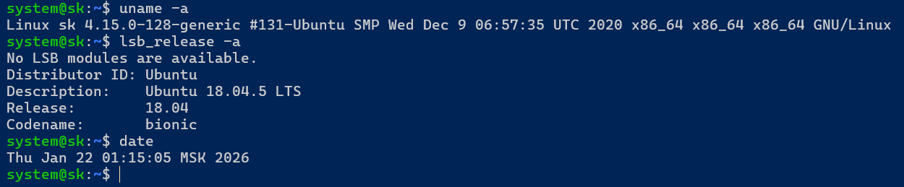

##### 2. Ключевые сервисы.
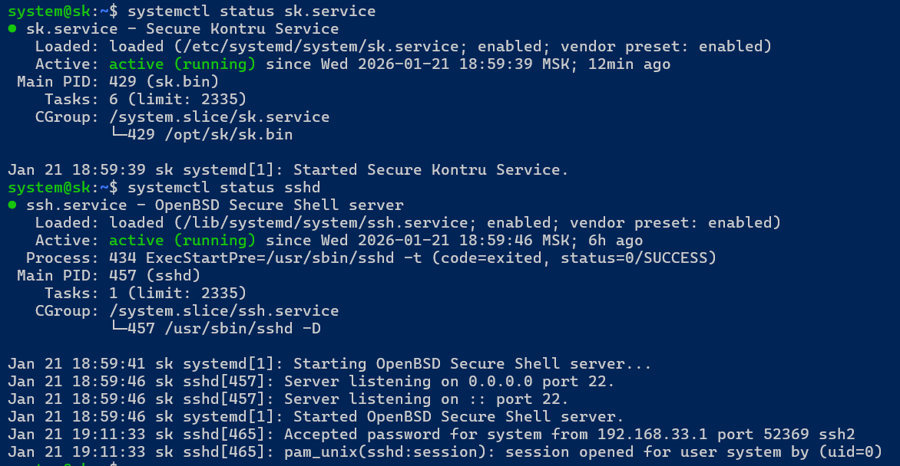

#### 1. Фаервол.
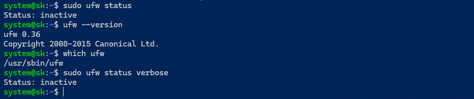

UFW установлен, но не запущен.

#### 2. nmap

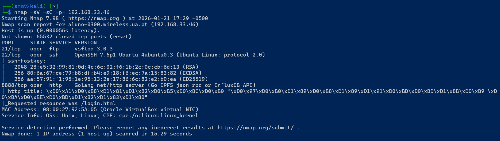</br>

В ходе первичного сканирования целевого узла с использованием утилиты nmap были выявлены следующие активные сервисы:

* FTP-сервер (vsftpd 3.0.3) на порту 21/tcp;</br>
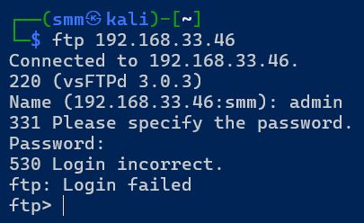</br>
Я сходу угадар имя пользователя. </br>
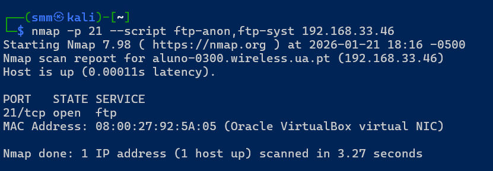</br>
Анонимный доступ к FTP отключён.</br></br>

* SSH-сервер (OpenSSH 7.6p1) на порту 22/tcp;</br>
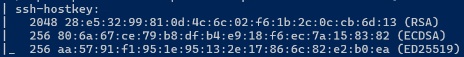</br>
На сервере используется устаревшая версия OpenSSH с поддержкой нескольких криптографических алгоритмов, включая **RSA 2048** (минимально допустимый уровень, для защищённых контуров и КТ) и **ECDSA**(часто запрещён или ограничен в защищённых контурах, не рекомендован в ряде российских и корпоративных профилей безопасности), без признаков применения строгой криптополитики. Парольная аутентификация, исходя из предоставленных учетных данных, вероятно разрешена. *Мы-то об этом знаем из документации, но теперь это и может быть понятно и злоумышленнику.*</br></br>

##### Пробуем воспользоваться уязвимостью

Создал пользователя `boss` с неким паролем.
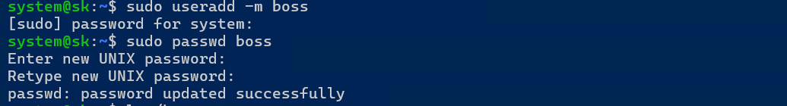

Воспользовался приложением "из коробки" Kali- hydra.


В итоге всё нашлось.


##### Рекомендуемые меры.
* установить fail2ban
* убрать аутентификацию по паролю `PasswordAuthentication` в натсройках сервиса sshd.
* использоавть для аутентификации только ssh- ключи
* изменить номер порта
* вообще спрятать хост за NAT или выделенным bastion-хостом

* HTTP-сервис приложения на порту 8888/tcp.</br>
Сканирование подтвердило, что веб-приложение функционирует по протоколу HTTP без использования шифрования. Также обнаружен FTP-сервис, использование которого не упоминается в документации и не соответствует требованиям защиты информации, относящейся к коммерческой тайне. 

Данная конфигурация не соответствует требованиям к защите информации, составляющей коммерческую тайну, и увеличивает возможности атаки.

##### Рекомендуемые меры.

* отключение неиспользуемых сервисов;
* настройка межсетевого экрана (UFW);
* ограничение сетевых интерфейсов, на которых слушает сервис.

#### 3. Сам сервис


Скервис запущен под пользователем `root`, что недопустимо и черервато полным контролем над системой в случае его взлома. да и просто ошибка в сервисе может привести  кполомке всей системы. Однако `systemctl` прекрасно показывает расположение бинарника и простому пользователю. 


Сервис **не содержит директив** типа:
* 'NoNewPrivileges=true' Запрещает процессу повышать привилегии
* 'ProtectSystem=strict' Монтирует /usr, /etc, /boot как read-only
* 'ProtectHome=true' Запрещает доступ к домашним директориям '/home', '/root', '/run/user'
* 'PrivateTmp=true' Выдаёт сервису отдельный '/tmp' что бы не слить случайно данные, которые должны уничтожаться по идее
* 'PrivateDevices=true' Закрывает доступ к '/dev', а там- диски и т.п.
* 'CapabilityBoundingSet=' Ограничивает Linux capabilities (даже для 'root')
* 'RestrictAddressFamilies=' Ограничивает типы сетевых сокетов
* 'ReadWritePaths=/opt/sk' Разрешает запись только туда, где это нужно
* и т.п., можно почитать в `man systemd.exec`. В общем, я много узнал о настройках сервисов в работе над этим заданием, премного благодарен. 

Обощу. Отсутствуют механизмы изоляции и ограничения привилегий сервиса sk.service (systemd hardening). Любые ошибки в логике приложения приводят к неконтролируемому доступу к файловой системе, сетевым ресурсам и потенциальной компрометации ОС. Возможные последствия: Утечка ПДн, нарушение целостности данных, несанкционированный доступ к информации, составляющей коммерческую тайну.

Вернёмся к началу этого раздела. А простой-ли у нас пользователь? Что покажет `visudo`?

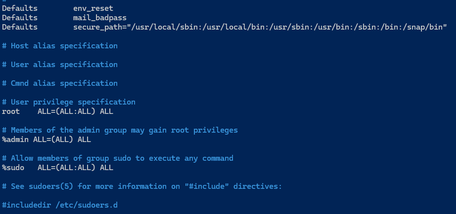
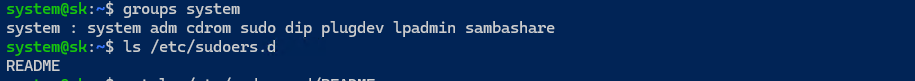

Пользовательские учётные записи, не являющиеся административными, входят в группу sudo и обладают полным root-доступом без ограничений команд и контекста выполнения. Это нарушает принцип минимальных привилегий и увеличивает радиус поражения при компрометации учётной записи или прикладного сервиса.

##### рекомендуемые меры

* Запрет использования служб active directory;
* запуск сервиса от отдельного системного пользователя;
* пересмотр состава группы sudo;
* ограничение выполняемых команд;
* применение принципа минимальных привилегий.
* применение механизмов изоляции, описанных выше.

#### 4. Сеть

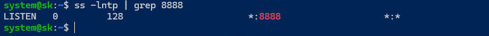

Сервис слушает все внешние соединения. Может быть не совсем верно, если он создан для локального использования.


#### 5. База данных

Как показал скан, открытых портов, характерных для различных типов баз данных нет. Да и вообще, нет лишних открытых портов. Значит- беза внутри хоста, что ожидаемо.

Приверяем директорию приложения, и находим базу.

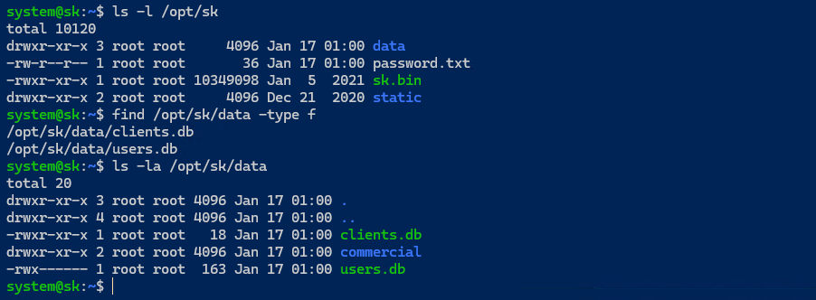

Можно изменять содержимое базы. Т.е. возможность несанкционированной модификации данных пользователей путём прямой записи в файл users.db вне механизмов приложения.

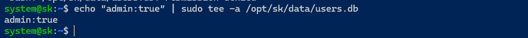

Сервис при этом уже не поднялся.


Так как просто была дописана строчка на 11 символов в конец файла, то всё лечится.

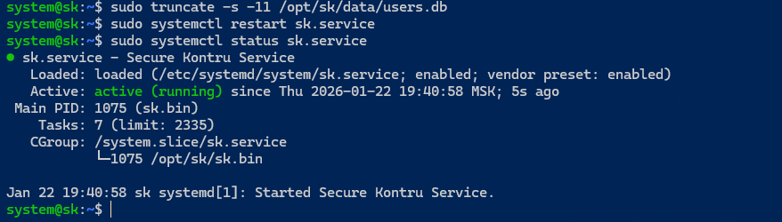


#### 6. Атаки извне

##### 6.1 Проверка защиты от перебора

Делаем простой скрипт:
```
#!/bin/bash

count=0

max=$1
 for ((i=1; i<=max; i++)); do
  code=$(curl -s -o /dev/null -w "%{http_code}\n" \
  -d "login=admin&password=test$i" \
  http://192.168.33.46:8888/login)
  if [[ "$code" == "200" ]]; then
    ((count++))
  fi
done

echo "count=$count"
```

Как видно, пароли можно перебирать бесконечно. Приложение всегда возвращает 200 статус, даже если креды не подошли. Хотя стоит отметить генерацию ключа, т.е. существует вероятность что простым перебором ключ будет сложно подобрать.


##### Рекомендуемые меры.
* ограничение количества попыток входа;
* временная блокировка учётной записи;
* введение задержек между попытками;
* корректные HTTP-коды ответов;
* журналирование неудачных попыток входа.

#### 7. SQL иньекции


Проверил устойчивость к SQL-инъекциям, включая передачу специальных символов, логических выражений и time-based payload’ов. Признаков SQL-инъекций выявлено не было: поведение приложения не изменялось, ошибки СУБД отсутствовали, задержки обработки запросов не наблюдались.

Вместе с тем выявлена слабость логики обработки аутентификации: приложение возвращает HTTP-код 200 OK независимо от результата проверки учётных данных. Различие между успешной и неуспешной аутентификацией определяется исключительно содержимым HTML-ответа, что упрощает автоматизацию атак перебора и затрудняет аудит событий безопасности.


# Продолжение следует. Хотя тут можно копаться бесконечно :)

